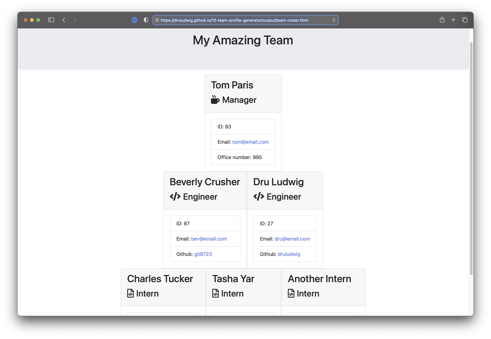

# TeamBuilder v0.9
  App Walkthrough: <a href="https://meetdru.com/files/team-builder/">https://meetdru.com/files/team-builder/</a>  
    Output example: <a href="https://druludwig.github.io/10-team-profile-generator/output/team-roster.html">https://druludwig.github.io/10-team-profile-generator/output/team-roster.html</a>  
   
  ## Description 
  A command-line app that turns user input into a working team directory. 
  ## Personal Notes
  This project was another significant stepping stone in my personal progress. I may have taken an unconventional approach in a few places, but I'm proud I got it to work.
 
  ## Installation 
  This app does not have an accessible UI and is not yet intended for distribution. 
  ## Instructions 
  1. Launch app in command line (updated version will have a true UI)
  2. Follow prompts
  3. Retrieve output from output folder 
  ## Testing 
  Please reference package.json for testing used 
  ## License 
  Use of this project is subject to the terms and conditions of the <a href="https://www.mit.edu/~amini/LICENSE.md">MIT License</a>. 

  
  ## Screenshot of Output
  
